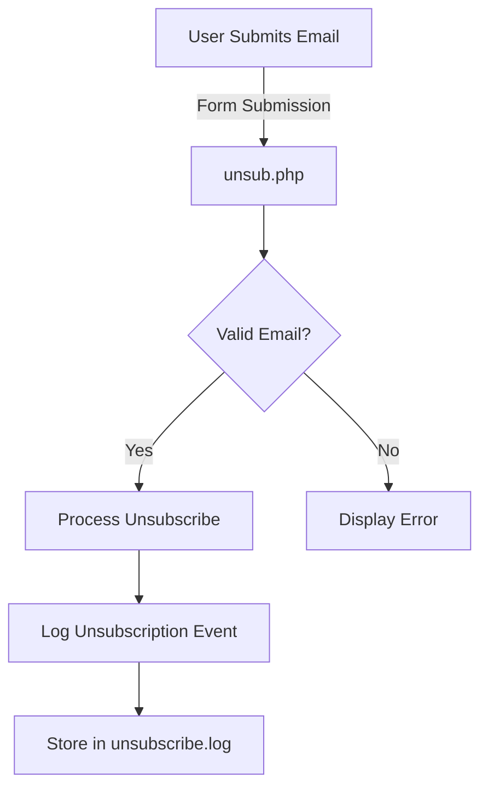

<h1 align="center">🚀 <a href="https://github.com/ronknight/unsubscribe-system">Unsubscribe System</a></h1>

<h4 align="center">🔧 A PHP-based system for managing email unsubscriptions efficiently.</h4>

<p align="center">
  <a href="https://twitter.com/PinoyITSolution"></a>
  <a href="https://github.com/ronknight?tab=followers"></a>
  <a href="https://github.com/ronknight/unsubscribe-system/stargazers"></a>
  <a href="https://github.com/ronknight/unsubscribe-system/network/members"></a>
  <a href="https://youtube.com/@PinoyITSolution"></a>
  <a href="https://github.com/ronknight/unsubscribe-system/issues"></a>
  <a href="https://github.com/ronknight/unsubscribe-system/blob/main/LICENSE"></a>
  <a href="#"></a>
  <a href="https://github.com/ronknight"></a>
</p>

<p align="center">
  <a href="#project-overview">Project Overview</a> •
  <a href="#files">Files</a> •
  <a href="#installation">Installation</a> •
  <a href="#usage">Usage</a> •
  <a href="#logs">Logs</a> •
  <a href="#visualization">Visualization</a> •
  <a href="#disclaimer">Disclaimer</a>
</p>

## 🔍 Project Overview

This project is a PHP-based system designed to manage email unsubscription requests. Users can unsubscribe from mailing lists, and the system logs these requests for record-keeping and compliance purposes. It is designed to be lightweight and easy to integrate into existing applications.

## 📂 Files

### 1. `unsub.php`
Handles the logic for processing unsubscribe requests and logs relevant information into a file for audit purposes.

### 2. `index.html`
A simple front-end form that allows users to enter their email addresses and submit a request to unsubscribe from email lists.

### 3. `unsubscribe.log`
A log file that tracks each unsubscription event, including the email address, timestamp, and IP address of the request.

## ⚙️ Installation

1. Clone the repository:
   ```bash
   git clone https://github.com/ronknight/unsubscribe-system.git
   ```

2. Navigate to the project directory:
   ```bash
   cd unsubscribe-system
   ```

3. Start the PHP server (if you're using PHP's built-in server):
   ```bash
   php -S localhost:8000
   ```

4. Visit `http://localhost:8000` in your browser to access the system.

## 📝 Usage

1. Open the form in your browser (`index.html`).
2. Enter the email address you want to unsubscribe from your mailing list.
3. Submit the form, and the system will log the unsubscription event.

## 📜 Logs

The `unsubscribe.log` file contains records of every unsubscription request processed by the system. Each entry includes:
- The user's email address
- The timestamp of the request
- The IP address from which the request was made

## 📊 Visualization



The flowchart above demonstrates the process of how the unsubscribe system operates:

1. The user submits their email address via the form.
2. The system checks if the email is valid.
3. If valid, it processes the unsubscription and logs the event. If not, an error message is displayed.

## ⚠️ Disclaimer

This project is intended for managing email unsubscriptions. Ensure compliance with privacy regulations such as GDPR and the CAN-SPAM Act. The system is designed to assist in fulfilling email marketing legal requirements but should be used responsibly.
